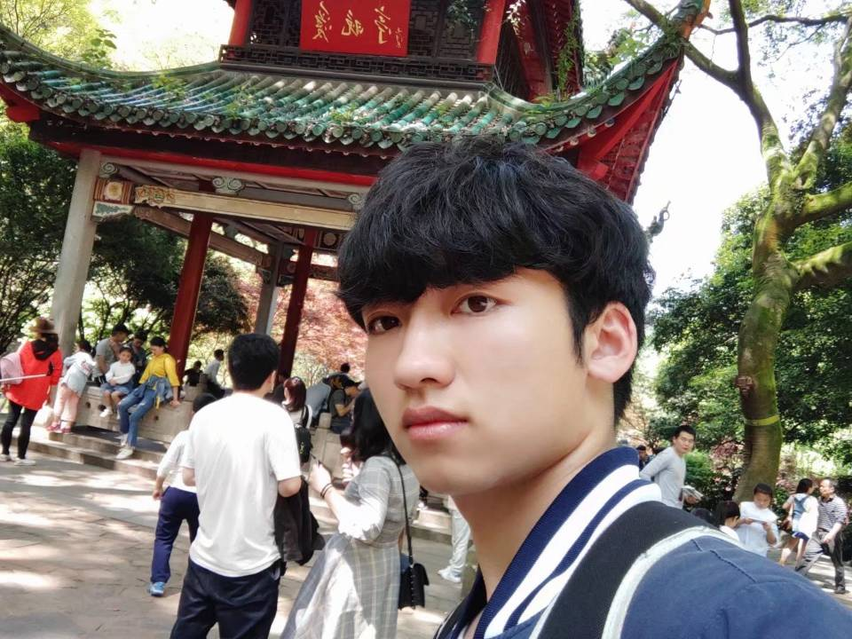
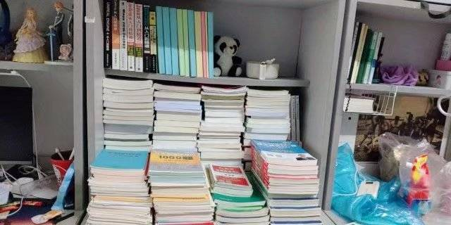

<h1 align="center">
  
</h1>

 

  Hi, I'm shuohao yang, An avid fan of game engines
   
      
  🔬 I am currently working at Kingsoft as a game engine development engineer   
     
  🎓 I graduated from Guilin University of Electronic Science and Technology with a degree in Digital Media Technology
   
  💻 I am extremely passionate about everything related to computers
   
  📚 I am currently working on the Unreal Engine
   
  💬 Ask me anything about from <a href="https://github.com/yang-shuohao/yang-shuohao/issues" title="Issues">Here</a>
   
  📫 How to reach me: <a href="mailto: 2499134263@qq.com">2499134263@qq.com</a>

<h2 align="center">⚡ Stats ⚡</h2>
 

  

    
    
  

           
  

    
  

   
  

<h2 align="center">👨‍💻 Repositories 👨‍💻</h2>
 

  

      

  
  

      
<h4 align="center">
  <a href="https://github.com/yang-shuohao?tab=repositories" title="Show Repositories">🔎 Show More 🔍</a>
</h4>
<h2 align="center">⚡ Photo ⚡</h2>
 

  

    
    
  

    

    
    
  

    

    
    
  

    

    
    
  

    

    
  

<!--
**yang-shuohao/yang-shuohao** is a ✨ _special_ ✨ repository because its `README.md` (this file) appears on your GitHub profile.

Here are some ideas to get you started:

- 🔭 I’m currently working on ...
- 🌱 I’m currently learning ...
- 👯 I’m looking to collaborate on ...
- 🤔 I’m looking for help with ...
- 💬 Ask me about ...
- 📫 How to reach me: ...
- 😄 Pronouns: ...
- ⚡ Fun fact: ...

Notes: If you want use this readme, firstly star it please. If you can't align your repositories like this, please change your repository desription to shorter than now. Maybe 4 or 5 word will be good.

-->
